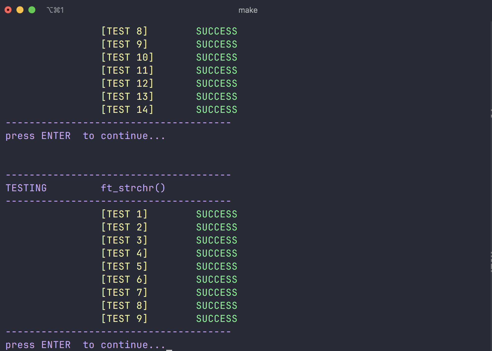

# libft_test_suit
i made a test suit for libft project in 42 cursus
# usage
1. clone this repo using the folowwing command :
    ```
   git clone https://github.com/Ayyoudev/libft_test_suit libft_test_suite
    ```

3. put your libft folder so that : 
```
    |---libft_test-suite.
        |---test_suit
        |---libft    // !the folder name is important
```
3. run `cd test_suit`
4. Finally you can just run `make` and the evaluation should start

# ScreenShot

# Note
 this version contains only tests from ft_isalpha() to ft_split()
